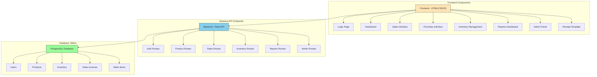

```mermaid
graph TB
    A[Frontend - HTML/CSS/JS] --> B[Backend - Flask API]
    B --> C[PostgreSQL Database]
    
    subgraph "Frontend Components"
        A1[Login Page]
        A2[Dashboard]
        A3[Sales Interface]
        A4[Purchase Interface]
        A5[Inventory Management]
        A6[Reports Dashboard]
        A7[Admin Panel]
        A8[Receipt Template]
        
        A --> A1
        A --> A2
        A --> A3
        A --> A4
        A --> A5
        A --> A6
        A --> A7
        A --> A8
    end
    
    subgraph "Backend API Endpoints"
        B1[Auth Routes]
        B2[Product Routes]
        B3[Sales Routes]
        B4[Inventory Routes]
        B5[Reports Routes]
        B6[Admin Routes]
        
        B --> B1
        B --> B2
        B --> B3
        B --> B4
        B --> B5
        B --> B6
    end
    
    subgraph "Database Tables"
        C1[Users]
        C2[Products]
        C3[Inventory]
        C4[Sales Invoices]
        C5[Sales Items]
        
        C --> C1
        C --> C2
        C --> C3
        C --> C4
        C --> C5
    end
    
    style A fill:#ffe4b5,stroke:#333
    style B fill:#87ceeb,stroke:#333
    style C fill:#98fb98,stroke:#333
```